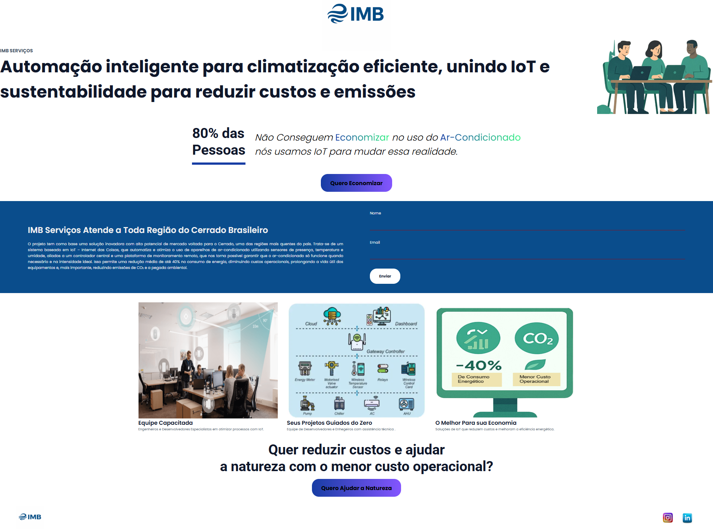

IMB - SERVIÇOS DE IoT
O projeto tem como base uma solução inovadora com alto potencial de mercado voltada para o Cerrado, uma das regiões mais quentes do país. Trata-se de um sistema baseado em IoT – Internet das Coisas, que automatiza e otimiza o uso de aparelhos de ar-condicionado utilizando sensores de presença, temperatura e umidade, aliados a um controlador central e uma plataforma de monitoramento remoto,  que nos torna possível garantir que o ar-condicionado só funcione quando necessário e na intensidade ideal. Isso permite uma redução média de até 40% no consumo de energia, diminuindo custos operacionais, prolongando a vida útil dos equipamentos e, mais importante, reduzindo emissões de CO₂ e a pegada ambiental.

